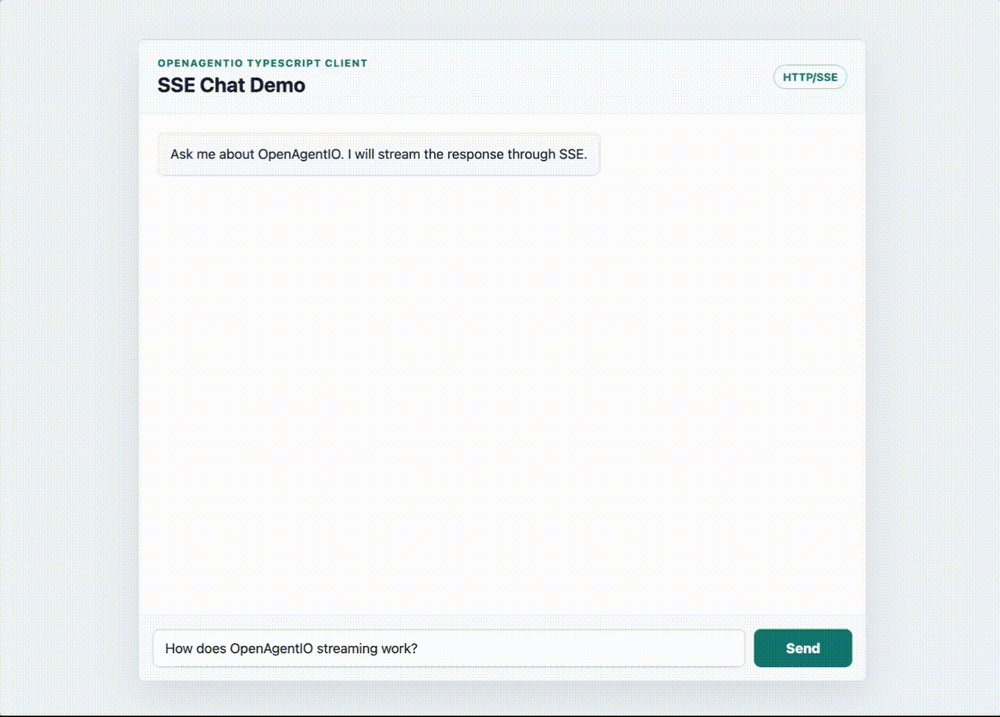

# OpenAgentIO SDK Examples

This directory contains minimal Go/Python/TS SDK examples for OpenAgentIO. Each scenario focuses on one core communication pattern so you can quickly understand how Agents work together.

Most examples use NATS to demonstrate distributed Agent communication. OpenAgentIO also supports an in-memory transport for single-process local demos.

<details>
<summary>Table of Contents</summary>

- [How to install NATS Server](#how-to-install-nats-server)
  - [On your local machine](#on-your-local-machine)
  - [Kubernetes cluster](#kubernetes-cluster)
- [Install](#install)
- [Transport Modes](#transport-modes)
- [Request/Reply Pattern](#requestreply-pattern)
- [Pub/Sub Pattern](#pubsub-pattern)
- [Stream Pattern](#stream-pattern)
- [Parallel Execution Pattern](#parallel-execution-pattern)
- [Agent Handoff Pattern](#agent-handoff-pattern)
- [Async Task Pattern](#async-task-pattern)
- [Function Calling Pattern](#function-calling-pattern)
- [HTTP/SSE Chat Pattern](#httpsse-chat-pattern)
- [More Examples](#more-examples)

</details>

## How to install NATS Server
### On your local machine
```
docker run -d \
  --name nats-js \                                                                               -p 4222:4222 \
  -p 8222:8222 \
  -v nats-data:/data \
  nats:latest \
  -js -sd <:customize local path>
```

### Kubernetes cluster 

You can refer to the official NATS documentation.
https://docs.nats.io/running-a-nats-service/nats-kubernetes

## Install

1. Go SDK (1.25+)

```sh
go get github.com/ModulationAI/openagentio
```

2. Python SDK (3.10+)

```sh
pip install openagentio
```

3. TypeScript SDK

```sh
npm install @openagentio/client
```

Before running the examples, point the SDK to your local NATS server:

```sh
export NATS_URL=nats://localhost:4222
```

## Transport Modes

OpenAgentIO supports two transport modes:

- **NATS**: use this when Agents run as separate processes or on different machines. Most examples in this repository use this mode.
- **InMem**: use this when all Agents run inside one process. This is useful for local demos, tests, and zero-dependency examples.

Switching transport is just a matter of changing the transport passed to `bus.New`.

NATS:

```go
import "github.com/ModulationAI/openagentio/pkg/transport/dial"

driver, _ := transportdial.Dial(ctx, transportdial.WithNATSName("my-agent"))
b, _ := bus.New(bus.WithAgentID("my-agent"), bus.WithTransport(driver))
```

InMem:

```go

import "github.com/ModulationAI/openagentio/pkg/transport/inmem"

driver := inmem.New()
b, _ := bus.New(bus.WithAgentID("my-agent"), bus.WithTransport(driver))
```

See `go_sdk_example/scenarios/orchestrator/main.go` for a single-process InMem example.

## Request/Reply Pattern

This scenario shows the simplest request/reply flow: one Agent sends a request, and another Agent handles it and returns a response.

### How to Run

Terminal 1:

```bash
go run ./scenarios/request_reply/responder_agent
```

Terminal 2:

```bash
go run ./scenarios/request_reply/requester_agent
```

### Example Request

```go
Question{Text: "hello from requester-agent"}
```

### Flow

```text
main_agent
  -> Invoke("responder-agent", question)

responder-agent
  -> Receives Question
  -> Creates Answer

responder-agent
  -> Returns Answer to main_agent

main_agent
  -> Prints the response
```

### When to Use It

Use this pattern when the caller needs an immediate response, for example:

- Ask another Agent for a specific capability
- Send input to another Agent for processing
- Assign work to a target Agent and wait for the final result

You can think of this pattern as a remote function call between Agents. The caller only needs to know the target Agent name and request payload; the target Agent owns the processing logic.

## Pub/Sub Pattern

This scenario shows event-based communication: one Agent publishes a message to a topic, and another Agent receives it by subscribing to that topic.

Unlike request/reply, the publisher does not wait for a response. It only emits an event. Any Agent subscribed to the same event type can receive it.

### How to Run

Terminal 1:

```bash
go run ./scenarios/pub_sub/subscriber_agent
```

Terminal 2:

```bash
go run ./scenarios/pub_sub/publisher_agent
```

### Example Message

```go
Message{
    From: "publisher-agent",
    Text: "hello from OpenAgentIO pub/sub",
}
```

### Flow

```text
subscriber_agent
  -> Subscribe("agent.message.created")

publisher_agent
  -> Publish("agent.message.created", message)

subscriber_agent
  -> Receives Message
  -> Prints the message payload
```

### When to Use It

Use this pattern when the sender does not need an immediate response, for example:

- Broadcast a status update
- Notify other Agents that something happened
- Let multiple Agents react to the same event independently

You can think of this pattern as an event notification. The publisher only announces what happened; subscribers decide how to react.

## Stream Pattern

This scenario shows a streaming response: one Agent sends a request, and another Agent sends the answer back in multiple chunks.

Unlike request/reply, the caller does not wait for one final response only. It receives partial updates as soon as they are available, then receives a final message when the stream is complete.

### How to Run

Terminal 1:

```bash
go run ./scenarios/stream/stream_responder
```

Terminal 2:

```bash
go run ./scenarios/stream/stream_requester
```

### Example Request

```go
Prompt{Text: "stream a short greeting"}
```

### Flow

```text
stream_requester
  -> StreamInvoke("stream-responder", prompt)

stream-responder
  -> Receives Prompt
  -> Sends started event
  -> Sends delta: "hello "
  -> Sends delta: "from "
  -> Sends delta: "stream-responder"
  -> Sends final result

stream_requester
  -> Prints each delta as it arrives
  -> Prints the final payload
```

### When to Use It

Use this pattern when the response may take time and partial output is useful, for example:

- Stream generated text from an Agent
- Show progress while a long-running operation is executing
- Return incremental analysis results before the final answer is ready

You can think of this pattern as request/reply with live updates. The caller still targets one Agent, but the response arrives over time instead of all at once.

## Parallel Execution Pattern

This scenario shows fan-out/fan-in execution: one coordinator Agent sends the same request to multiple worker Agents in parallel, then combines their responses.

Unlike a single request/reply call, this pattern lets several Agents work at the same time. The coordinator waits until all worker results are available before printing the combined output.

### How to Run

Terminal 1:

```bash
go run ./scenarios/parallel_execution/worker_agent
```

Terminal 2:

```bash
go run ./scenarios/parallel_execution/coordinator_agent
```

### Example Request

```go
AnalyzeRequest{
    Text: "OpenAgentIO helps agents communicate with each other.",
}
```

### Flow

```text
coordinator_agent
  -> Invoke("summary-agent", request)
  -> Invoke("sentiment-agent", request)
  -> Invoke("keywords-agent", request)

summary-agent
  -> Returns a short summary

sentiment-agent
  -> Returns sentiment

keywords-agent
  -> Returns keywords

coordinator_agent
  -> Waits for all results
  -> Prints the combined result
```

### When to Use It

Use this pattern when a task can be split across multiple independent Agents, for example:

- Run summary, sentiment, and keyword extraction at the same time
- Ask several specialist Agents to analyze the same input
- Reduce total latency by executing independent work in parallel

You can think of this pattern as a coordinator asking several specialists for help at once, then merging their answers into one result.

## Agent Handoff Pattern

This scenario shows Agent handoff: one router Agent receives a request, decides which specialist Agent should handle it, and forwards the request to that specialist.

Unlike parallel execution, only one specialist handles the request. The router makes the routing decision, waits for the specialist response, then returns that response to the original caller.

### How to Run

Terminal 1:

```bash
go run ./scenarios/agent_handoff/handoff-agents
```

Terminal 2:

```bash
go run ./scenarios/agent_handoff/user_agent
```

### Example Request

```go
Question{Text: "I need help with my invoice"}
```

### Flow

```text
user_agent
  -> Invoke("router-agent", question)

router-agent
  -> Checks whether text contains invoice, billing, or payment
  -> Invoke("billing-agent", question)

billing-agent
  -> Returns Answer

router-agent
  -> Returns Answer to user_agent

user_agent
  -> Prints the response
```

If the text is not related to invoice, billing, or payment, `router-agent` hands the request off to `tech-agent` instead.

### When to Use It

Use this pattern when one entry Agent should route work to the right specialist, for example:

- Send billing questions to a billing Agent
- Send technical issues to a support Agent
- Hide specialist selection from the user-facing Agent

You can think of this pattern as a front desk. The user asks one Agent, and that Agent forwards the request to the specialist best suited to answer.

## Async Task Pattern

This scenario shows asynchronous task execution: one Agent submits a task, receives an immediate acceptance response, and later receives a completion event.

Unlike request/reply, the first response does not contain the final result. It only confirms that the task was accepted. The final result is delivered later through pub/sub.

### How to Run

Terminal 1:

```bash
go run ./scenarios/async_task/worker_agent
```

Terminal 2:

```bash
go run ./scenarios/async_task/task_agent
```

### Example Request

```go
TaskRequest{Input: "generate a short report"}
```

### Flow

```text
task-client
  -> Subscribe("agent.task.completed")
  -> Invoke("task-worker", taskRequest)

task-worker
  -> Receives TaskRequest
  -> Returns TaskAccepted with task_id
  -> Starts the work in the background

task-client
  -> Prints accepted status
  -> Waits for the matching completion event

task-worker
  -> Publishes TaskCompleted with the same task_id

task-client
  -> Receives TaskCompleted
  -> Prints the final result
```

### When to Use It

Use this pattern when the final result may take longer than a normal request/reply call, for example:

- Submit a long-running job
- Start a background report generation task
- Accept work quickly and notify the caller when it finishes

You can think of this pattern as job submission. The caller gets a task ID immediately, then listens for the completion event that carries the final result.

## Function Calling Pattern

This scenario shows function calling across Agents: one Agent sends a structured function call, and another Agent executes a local function and returns the result.

The functions themselves are ordinary local Go functions. OpenAgentIO is used to let another Agent call those functions through a clear request/response boundary.

### How to Run

Terminal 1:

```bash
go run ./scenarios/function_calling/tool_agent
```

Terminal 2:

```bash
go run ./scenarios/function_calling/caller_agent
```

### Example Requests

```go
FunctionCall{
    Name: "add_numbers",
    Arguments: map[string]any{
        "a": 7,
        "b": 5,
    },
}
```

```go
FunctionCall{
    Name: "uppercase_text",
    Arguments: map[string]any{
        "text": "hello openagentio",
    },
}
```

### Flow

```text
caller_agent
  -> Invoke("tool-agent", functionCall)

tool-agent
  -> Receives FunctionCall
  -> Looks up the function by name
  -> Runs the local Go function
  -> Returns FunctionResult

caller_agent
  -> Prints the function result
```

### When to Use It

Use this pattern when one Agent should expose local capabilities to other Agents, for example:

- Run utility functions such as formatting, validation, or calculation
- Wrap internal business logic behind an Agent interface
- Let an AI Agent call tools without knowing where the tool is implemented

You can think of this pattern as a small tool server. The caller sends the function name and arguments; the tool Agent owns the actual implementation.

## HTTP/SSE Chat Pattern

This scenario shows a browser chat UI talking to OpenAgentIO through the HTTP/SSE adapter. The Go process runs the Agent server, and the browser uses the TypeScript client to stream the assistant response into a chat bubble.

Unlike the other Go-only examples, this scenario uses a web frontend as the client. This is closer to how SSE is usually consumed in real applications.

### How to Run

Terminal 1:

```bash
cd go_sdk_example/scenarios/http_sse
go run -tags=server .
```

Terminal 2:

```bash
cd ts_sdk_example/scenarios/sse_client
npm install
npm run dev
```

Then open the Vite URL in your browser.

[]()

### Example Request

```ts
for await (const frame of client.streamInvoke("assistant", {
  message: "How does OpenAgentIO streaming work?",
  delay_ms: 140,
})) {
  if (frame.event_type === "agent.response.delta") {
    assistantBubble.textContent += frame.payload.delta;
  }
}
```

### Flow

```text
web_client
  -> User sends a chat message
  -> streamInvoke("assistant", { message, delay_ms })

go_sse_server
  -> Handles POST /v1/agents/assistant/stream
  -> Sends started frame
  -> Sends text delta frames
  -> Sends final frame

web_client
  -> Appends each text delta to the assistant message bubble
  -> Shows the answer as it is being generated
```

### When to Use It

Use this pattern when a frontend application needs to call Agents over HTTP and show live responses, for example:

- Browser-based chat or assistant UI
- Real-time progress updates
- Streaming generated content to a web page

You can think of this pattern as a chat-friendly bridge between web applications and Agent workflows. The Go server exposes OpenAgentIO over HTTP/SSE, and the TypeScript client turns streamed Agent events into a live browser experience.

## More Examples

More OpenAgentIO scenarios and Agent communication patterns are coming soon, including:

- Compatibility examples for OpenAI-style and Anthropic-style APIs
- Integration examples with Agent frameworks such as LangGraph, AgentScope, and Hermes
- More advanced orchestration, tool use, and production integration patterns

Stay tuned for upcoming examples that show how OpenAgentIO can connect different Agent runtimes, protocols, and application architectures.
